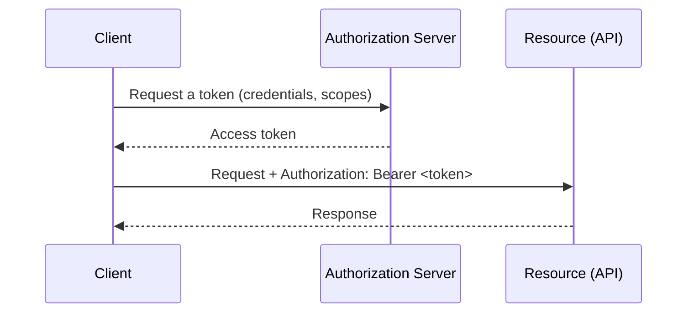

import Quiz from '@site/src/components/Quiz';
import LessonComplete from '@site/src/components/LessonComplete';
import TopicIconBadge from '@site/src/components/TopicIcon/Badge';
import LessonDownloads from '@site/src/components/LessonDownloads';

<TopicIconBadge id="authentication-basics" />

# Authentication Basics

Two words get used almost interchangeably in everyday conversation, but they answer
different questions:

- **Authentication** — *who are you?* Proving an identity.
- **Authorization** — *what are you allowed to do?* Checking permissions, once your
  identity is known.

A real-world analogy: showing your ID badge at a building's front desk is
**authentication** — it proves who you are. Whether that badge actually opens the
door to the server room is **authorization** — a separate check, done *after* your
identity is established.

## Common authentication methods

| Method | How it works | Strength | Typical use |
|---|---|---|---|
| **API key** | A single secret string sent with every request (often in a header or query param) | Weak–moderate — simple to leak, usually long-lived | Simple third-party APIs, low-risk integrations |
| **Basic authentication** | Username and password, base64-encoded, sent on every request | Weak — credentials travel on every call, no built-in expiry | Legacy systems, internal tools, usually paired with HTTPS as a minimum |
| **Bearer token** | A token (often short-lived) sent in the `Authorization` header | Moderate–strong, especially if short-lived and rotated | Most modern APIs |
| **OAuth 2.0** | A structured flow where an app gets a token from an authorization server, without ever handling the user's password | Strong — supports scoped, expiring, revocable access | Salesforce and most modern platforms |

## A plain preview of OAuth 2.0

OAuth 2.0 involves a few distinct players:

- The **client** — the app requesting access (e.g. a mobile app, or Salesforce itself
  making a callout).
- The **authorization server** — issues tokens after verifying identity and consent.
- The **resource** — the actual API or data being protected.
- **Scopes** — specific permissions a token is allowed to use (e.g. "read contacts
  only").
- **Access token** — the short-lived credential used on each API call.
- **Refresh token** — a longer-lived credential used to get a new access token
  without asking the user to log in again.

This lesson stops here deliberately — the *flows* (exactly how a client gets that
first token) are a deeper topic covered in a later lesson. For now, the important
idea is: **tokens are requested once, then used repeatedly**, instead of sending a
password on every single call.

## Why secrets must never go in code

A hardcoded API key or password in Apex, Flow, or any source file becomes part of
your **version control history forever** — even if you delete it in a later commit,
it's still recoverable from the repository's history. It can also leak through debug
logs, sandboxes refreshed from production, or anyone with read access to the code.

Salesforce's fix is the **Named Credential**: it stores the endpoint and
authentication details *outside* your Apex code. Your callout references the Named
Credential by name (`callout:My_API/...`), and Salesforce injects the real
`Authorization` header at send time — your code never sees, logs, or stores the
actual secret.

## Common mistakes

- **Putting secrets directly in code or version control.** Even a "temporary" hardcoded
  token in a sandbox has a way of reaching production.
- **Confusing 401 with 403.** A `401` means "I don't know who you are" (authentication
  failed); a `403` means "I know who you are, and you're not allowed to do this"
  (authorization failed). Debugging the wrong one wastes time.
- **Using long-lived tokens where a short-lived one would do.** The longer a token
  lives, the longer a leaked copy stays dangerous — prefer short-lived access tokens
  with a refresh token over one token that never expires.
- **Sharing a real person's login for a server-to-server integration.** It breaks the
  moment that person changes their password or leaves, and makes it impossible to
  tell "the integration did this" from "the person did this" in audit logs.

## Learn more on Trailhead

[Identity Basics](https://trailhead.salesforce.com/content/learn/modules/identity_basics)
introduces authentication and OAuth concepts at a beginner level.

<LessonDownloads topicId="authentication-basics" />

## Quiz

<Quiz quizId="authentication-basics" />

<LessonComplete topicId="authentication-basics" />
