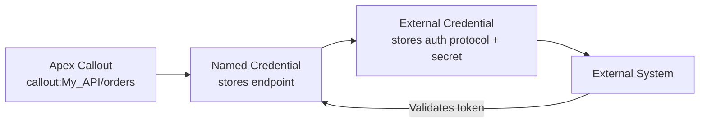

import Quiz from '@site/src/components/Quiz';
import LessonComplete from '@site/src/components/LessonComplete';
import TopicIconBadge from '@site/src/components/TopicIcon/Badge';

<TopicIconBadge id="authentication" />

# Authentication

Every integration eventually asks: **how does each side prove who it is?** Get this
wrong and you either lock legitimate traffic out, or — worse — leave a door open.
Salesforce separates "where am I calling, and with what credentials" (outbound) from
"who is calling me, and what are they allowed to do" (inbound).

## Outbound: proving who *Salesforce* is to someone else

When Salesforce calls out, it needs to authenticate itself to the external system.
The platform-native way to do this is a **Named Credential**, optionally paired with
an **External Credential** (for OAuth 2.0, AWS Signature, JWT, or custom header
schemes):

- The **Named Credential** stores the endpoint URL (and, for simpler legacy setups,
  the authentication directly).
- The **External Credential** (newer model) separates *how* to authenticate — protocol,
  tokens, certificates — from *where* to send the request, and can be shared across
  multiple Named Credentials.
- Apex never sees the raw secret. You call `callout:My_Named_Credential/path`, and
  Salesforce injects the right `Authorization` header before the request leaves the org.



Without a Named Credential, you'd be storing API keys or OAuth tokens as Custom
Metadata, Custom Settings, or (worse) hardcoded strings — all of which make rotation
harder and risk leaking secrets into debug logs or source control.

## Inbound: proving who's calling *Salesforce*

When an external system calls into Salesforce (REST API, Apex REST endpoints, SOAP),
it authenticates using one of:

- **OAuth 2.0** (recommended for most new integrations) — typically the
  **Client Credentials Flow** for server-to-server integration with no end user
  present, or the **JWT Bearer Flow** for trusted server-to-server integration that
  needs to act as a specific user.
- **Session ID / Basic password auth** — older, generally discouraged for new builds
  since it ties authentication to a live user session and password.

Whichever flow is used, the resulting **access token** is sent on every request:

```
Authorization: Bearer 00D...AbCdEfGh
```

Salesforce validates the token, resolves it to a user, and then enforces that user's
**profile, permission sets, field-level security, and sharing rules** on every object
the request touches — authentication tells Salesforce *who* is calling, but it's the
existing security model that decides *what* they can do.

## Common mistakes

- **Hardcoding tokens or passwords in Apex or Flow.** Use Named/External Credentials
  (outbound) or a proper OAuth flow (inbound) instead — see the
  [Security and Monitoring](./security-monitoring.md) lesson for more on secret hygiene.
- **Using a named user's password-based login for a server-to-server integration.**
  This breaks the moment that person changes their password or leaves the company.
  Prefer the JWT Bearer or Client Credentials flow with a dedicated integration user.
- **Giving the integration user "System Administrator".** Create a dedicated
  integration user with a minimal permission set scoped to exactly what the
  integration needs.
- **Assuming authentication equals authorization.** A valid token only proves identity;
  object and field-level permissions still apply to every record the call touches.

## Learn more on Trailhead

[Protect Secrets Using Platform Features](https://trailhead.salesforce.com/content/learn/modules/secure-secrets-storage/protect-secrets-using-platform-features)
covers Named Credentials and secret storage in more depth.

## Quiz

<Quiz quizId="authentication" />

<LessonComplete topicId="authentication" />
