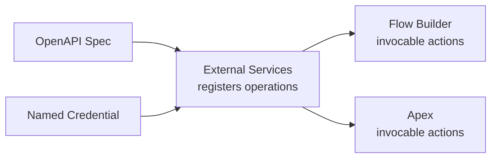

# Declarative Integration Options

Not every integration needs a developer. Salesforce's declarative tools cover a
surprising amount of ground — especially useful when the logic is simple, the team is
admin-led, or you want something a non-developer can maintain after you hand it off.

## Flow: HTTP Callout action

Flow Builder can make an outbound HTTP callout directly, using a schema you define
once (an OpenAPI-style spec, or the guided Setup wizard) against a Named Credential.
Once registered, the callout appears in Flow as a regular action — drag it in, map
input/output variables, done.

This is a great fit for:

- A straightforward "send this record's data to an external endpoint and read back a
  status" step inside a larger automated Flow.
- Admin teams who need to maintain the integration without touching Apex.

## External Services: declarative, reusable API actions

**External Services** goes a step further: register an external REST API's OpenAPI
specification once, and Salesforce generates invocable actions for each operation —
reusable across Flow, and callable from Apex as an invocable action too. This is the
declarative equivalent of hand-writing an `HttpRequest`/`HttpResponse` wrapper class.

## When declarative is the right call

| Choose declarative (Flow / External Services) when... | Choose Apex when... |
|---|---|
| The logic is a straightforward request/response with simple mapping | You need complex branching, loops, or custom retry/error logic |
| Admins need to own and maintain it long-term | The payload shape needs non-trivial transformation |
| The external API already has a clean OpenAPI spec | There's no spec, or the API is unusual enough that code is simpler |
| You're prototyping and want to validate the integration quickly | You're calling from a trigger context and need an async Apex job anyway |

They aren't mutually exclusive — a common pattern is Apex for complex processing, with
an invocable Apex action exposed so admins can still orchestrate it from Flow.

## Common mistakes

- **Reaching for Apex by default.** If a Flow HTTP Callout or External Services action
  covers the requirement, it's usually easier to maintain long-term — fewer deploys,
  no test classes to keep green, admin-editable.
- **Skipping the Named Credential.** Declarative tools still need a Named Credential
  for authentication — don't paste raw tokens into Flow variables.
- **Not handling the error path in Flow.** A failed callout needs an explicit Fault
  Path in Flow, just as Apex needs a `catch` block — it's easy to wire only the happy
  path and leave failures unhandled.
- **Outgrowing declarative silently.** As requirements grow (retries, complex
  transformation, chaining multiple calls), re-evaluate whether Apex is now the better
  fit rather than bolting more and more logic onto a Flow.

## Learn more on Trailhead

[External Services](https://trailhead.salesforce.com/content/learn/modules/external-services)
walks through registering an API spec and using the resulting actions in Flow.
