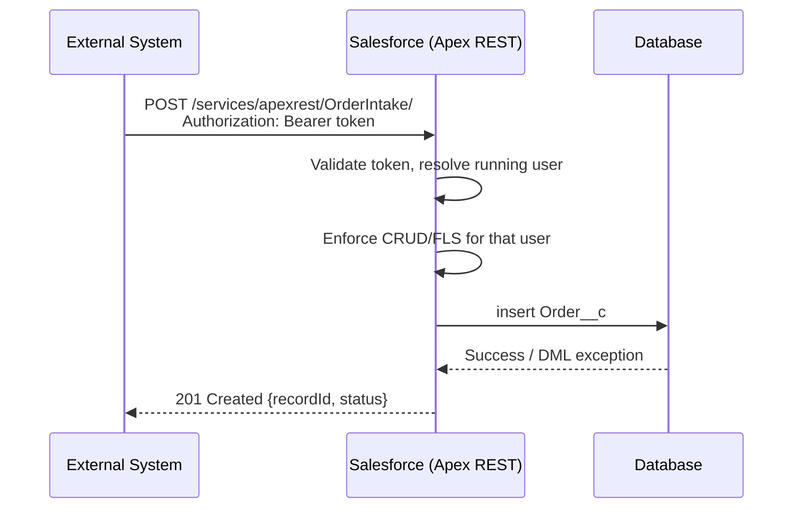

import Quiz from '@site/src/components/Quiz';
import LessonComplete from '@site/src/components/LessonComplete';
import TopicIconBadge from '@site/src/components/TopicIcon/Badge';
import LessonDownloads from '@site/src/components/LessonDownloads';

<TopicIconBadge id="inbound-apex-rest-soap" />

# Inbound Apex REST and SOAP

Sometimes the standard Salesforce REST/SOAP APIs (covered in
[Salesforce APIs](./salesforce-apis.md)) don't match what an external system expects —
maybe it needs a custom payload shape, or needs to trigger multi-object business logic
in one call. That's what **Apex REST** and **Apex SOAP web services** are for: you
write the endpoint, Salesforce exposes it.

## Standard REST API vs. Apex REST Service

Before building a custom endpoint, it's worth being clear on what the **standard REST
API** already gives you for free, so an Apex REST Service only gets built where it's
actually earning its keep:


| Aspect | Standard REST API | Apex REST Service |
|---|---|---|
| Purpose | Pre-built CRUD on Salesforce data, no code | Custom API for your own business logic |
| Endpoint | `/services/data/vXX.X/...` | `/services/apexrest/<yourEndpoint>` |
| Flexibility | Limited to standard create/read/update/delete operations | Fully customizable — any logic you can write in Apex |
| Implementation | None — it's already there | An Apex class annotated with `@RestResource` |
| Typical use | Simple data operations | Complex logic, multi-object transactions, integrations |
| Authentication | OAuth 2.0, Session ID, Named Credential | Same options — authentication doesn't change |

In short: reach for the standard REST API first (see
[Salesforce APIs](./salesforce-apis.md)) — build an Apex REST Service only when you
need logic the standard API genuinely can't express in one call.

## Apex REST

Annotate a class with `@RestResource` and its methods with the HTTP verb they handle:

```apex
@RestResource(urlMapping='/OrderIntake/*')
global with sharing class OrderIntakeService {

    @HttpPost
    global static ResponseWrapper createOrder() {
        RestRequest req = RestContext.request;
        RestResponse res = RestContext.response;

        Map<String, Object> payload =
            (Map<String, Object>) JSON.deserializeUntyped(req.requestBody.toString());

        try {
            Order__c order = new Order__c(
                External_Id__c = (String) payload.get('externalId'),
                Amount__c = (Decimal) payload.get('amount')
            );
            insert order;

            res.statusCode = 201;
            return new ResponseWrapper(order.Id, 'created');
        } catch (Exception e) {
            res.statusCode = 400;
            return new ResponseWrapper(null, 'error: ' + e.getMessage());
        }
    }

    global class ResponseWrapper {
        global Id recordId;
        global String status;
        ResponseWrapper(Id recordId, String status) {
            this.recordId = recordId;
            this.status = status;
        }
    }
}
```

This becomes reachable at:

```
POST /services/apexrest/OrderIntake/
Authorization: Bearer <access_token>
Content-Type: application/json

{ "externalId": "EXT-4821", "amount": 199.99 }
```

### A GET endpoint example

Not every Apex REST method writes data — a `@HttpGet` method can read a path parameter
straight off the URL and return a filtered list, same idea as a standard REST query but
shaped exactly how the caller needs it:

```apex
@RestResource(urlMapping='/opportunities/*')
global with sharing class OpportunityRestService {

    @HttpGet
    global static List<Opportunity> getOpportunities() {
        RestRequest req = RestContext.request;

        // The account Id is the last URL segment, e.g.
        // /services/apexrest/opportunities/001XXXXXXXXXXXXXXX
        String accountId = req.requestURI.substring(
            req.requestURI.lastIndexOf('/') + 1
        );

        return [
            SELECT Id, Name, StageName, Amount, CloseDate
            FROM Opportunity
            WHERE AccountId = :accountId
            AND IsClosed = false
        ];
    }
}
```

## Important Apex REST annotations and classes

| Annotation / class | Purpose |
|---|---|
| `@RestResource(urlMapping='/path')` | Marks the class as a REST resource and defines its endpoint URL |
| `@HttpGet` | Handles HTTP GET requests |
| `@HttpPost` | Handles HTTP POST requests |
| `@HttpPut` | Handles HTTP PUT requests |
| `@HttpDelete` | Handles HTTP DELETE requests |
| `RestContext.request` | The incoming request — headers, URL parameters, body |
| `RestContext.response` | Sets the outgoing response's status code, headers, and body |

## Apex SOAP web services

For SOAP, annotate a class `global` with `WebService` methods. Salesforce
auto-generates a WSDL you hand to the consuming system:

```apex
global class LegacyOrderService {
    webservice static String createOrder(String externalId, Decimal amount) {
        Order__c order = new Order__c(
            External_Id__c = externalId,
            Amount__c = amount
        );
        insert order;
        return order.Id;
    }
}
```

SOAP services are less common for new work — most teams reach for Apex REST unless an
existing SOAP-only consumer requires it.

## Request flow



## Common mistakes

- **Not validating input.** `JSON.deserializeUntyped` is permissive — check required
  fields exist and are the expected type before using them, and return a clear 4xx
  with a useful message when they aren't.
- **Returning 200 for everything, including failures.** Use real HTTP status codes
  (`201` created, `400` bad request, `404` not found, `500` unexpected error) so
  callers can handle outcomes programmatically instead of parsing text.
- **Forgetting `with sharing`.** Without it, your Apex REST class can run in a
  context that bypasses the calling user's record-level sharing rules.
- **Skipping CRUD/FLS checks.** `insert`/`update` still respect field-level security
  only if your code checks it (or you use patterns like `Security.stripInaccessible`);
  a `global without sharing` class with no checks can let an under-permissioned caller
  write data they shouldn't.
- **Designing a bespoke endpoint when the standard REST API already does the job.**
  Apex REST is for cases the standard API genuinely can't cover — custom validation,
  multi-object transactions, non-standard payload shapes — not a default.

## Learn more on Trailhead

[Apex Integration Services](https://trailhead.salesforce.com/content/learn/modules/apex_integration_services)
includes units on building and testing Apex web services.

<LessonDownloads topicId="inbound-apex-rest-soap" />

## Quiz

<Quiz quizId="inbound-apex-rest-soap" />

<LessonComplete topicId="inbound-apex-rest-soap" />
