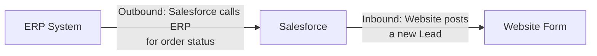

import Quiz from '@site/src/components/Quiz';
import LessonComplete from '@site/src/components/LessonComplete';
import TopicIconBadge from '@site/src/components/TopicIcon/Badge';
import LessonDownloads from '@site/src/components/LessonDownloads';

<TopicIconBadge id="inbound-vs-outbound" />

# Inbound vs Outbound Integration

Before REST or SOAP, before authentication, before any code — every integration
conversation starts with one question: **who dials the phone?**

Direction is defined from Salesforce's point of view, and it depends entirely on
*who starts the conversation*, not on which way the data happens to move. A system
that calls Salesforce can still end up reading data *out* of Salesforce; a callout
Salesforce makes can still bring data *back in*. Direction and data flow are two
different things, and mixing them up is the single most common confusion in this
whole topic.

## Outbound: Salesforce calls someone else

In an outbound integration, **Salesforce starts the conversation**. Apex, Flow, or a
declarative feature reaches out to another system and either sends data, asks for
data, or both.

| Real-world example | What's happening |
|---|---|
| Checking order status from an ERP | A Service Cloud agent opens a case and Salesforce calls the ERP to show the latest shipping status |
| Credit check or address verification | During checkout or account creation, Salesforce calls a third-party API to validate before saving |
| Requesting an e-signature after a deal closes | Closing an Opportunity triggers a callout to an e-signature provider to start the signing process |
| Sending a won Opportunity to finance | Salesforce pushes the closed-won deal to a billing or ERP system so invoicing can begin |

Typical tools: **Apex callouts** (`HttpRequest`/`HttpResponse`), **Flow HTTP Callout**
actions, **External Services**, legacy **Outbound Messages**, and **Platform Events**
published for another system to consume.

## Inbound: someone else calls Salesforce

In an inbound integration, **another system starts the conversation** and Salesforce
responds.

| Real-world example | What's happening |
|---|---|
| A website form creates a Lead | A marketing site posts form data straight into Salesforce as a new Lead record |
| A mobile app reads and updates Accounts | A field rep's app calls the REST API to pull account details and push updates while offline-synced data reconnects |
| An ERP sends price updates | Nightly, the ERP pushes updated price list data into Salesforce via the API |
| A payment gateway webhook confirms payment | After a customer pays, the gateway calls a Salesforce endpoint to confirm the transaction completed |

Typical tools: the **Salesforce REST, SOAP, and Bulk APIs**, **custom Apex REST or
SOAP services** you expose, and the **Pub/Sub API** for systems that want to stream
Salesforce events.

## Both directions, one diagram

Notice that in both cases, data can flow either way once the conversation starts —
an outbound callout can bring data *back*, and an inbound call can trigger Salesforce
to *send* something in its response. Direction only tells you who picked up the
phone first.

## Common mistakes

- **Confusing direction with data flow.** "Salesforce is receiving data" does not
  automatically mean "this is inbound." If Salesforce made the callout and the
  response contains the data, that's still outbound — Salesforce dialed the phone.
- **Assuming inbound is always more secure.** Both directions need proper
  authentication; an inbound Apex REST endpoint with weak access control is no safer
  than a careless outbound callout with a hardcoded token.
- **Forgetting that each direction needs its own authentication.** Outbound calls
  need Salesforce to prove *its* identity to the other system; inbound calls need the
  caller to prove *its* identity to Salesforce. They're two separate problems, solved
  with different tools — more on this in
  [Authentication Basics](./authentication-basics.md).

## Learn more on Trailhead

[Explore Integration Patterns and Practices](https://trailhead.salesforce.com/content/learn/trails/explore-integration-patterns-and-practices)
is a good next step once you're comfortable with direction — it covers the patterns
built on top of it.

<LessonDownloads topicId="inbound-vs-outbound" />

## Quiz

<Quiz quizId="inbound-vs-outbound" />

<LessonComplete topicId="inbound-vs-outbound" />
