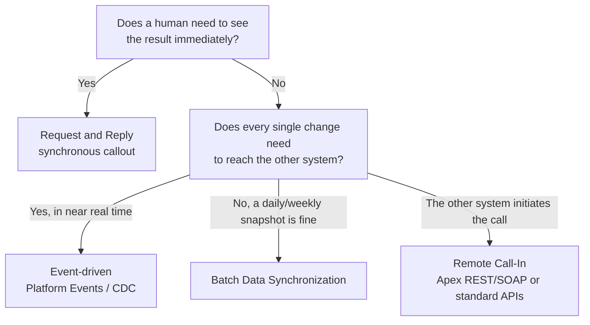

import Quiz from '@site/src/components/Quiz';
import LessonComplete from '@site/src/components/LessonComplete';
import TopicIconBadge from '@site/src/components/TopicIcon/Badge';
import LessonDownloads from '@site/src/components/LessonDownloads';
import CourseProgress from '@site/src/components/CourseProgress';

<TopicIconBadge id="integration-patterns" />

# Integration Patterns

Before you write a single line of Apex or configure a single Named Credential, every
integration project needs an answer to one question: **who talks first, and does
anyone wait for a reply?** The answer determines which pattern you're building, and
the pattern determines almost everything else — timeouts, retry logic, error handling,
and which Salesforce feature you reach for.

New to integration entirely? The **[Foundations](./inbound-vs-outbound.md)** section
covers the basics first — direction, protocols, request/response anatomy, JSON/XML,
authentication, and why Salesforce behaves differently for integrators — before this
lesson starts building on top of them. Here's where you stand across the whole course:

<CourseProgress />

## The four patterns you'll use most

| Pattern | Who initiates | Does the caller wait? | Typical use case |
|---|---|---|---|
| **Remote Process Invocation — Request and Reply** | Salesforce (or the external system) | Yes, synchronously | A user action needs an immediate result, e.g. a credit check during checkout |
| **Fire and Forget** | Salesforce (or the external system) | No | Logging an event externally; the sender doesn't need to know what happened next |
| **Batch Data Synchronization** | Either side, usually on a schedule | No — runs on its own cadence | Nightly price list sync, end-of-day order export |
| **Remote Call-In** | An external system calls into Salesforce | The external system waits for Salesforce's response | A mobile app or external portal reading/writing Salesforce records via the REST API |

A fifth pattern, **event-driven integration** (covered in its own lesson on
[Platform Events and Change Data Capture](./platform-events-cdc.md)), has become the
default choice for "notify other systems the moment something changes" — it avoids both
the fragility of synchronous calls and the staleness of batch jobs.

## Why the pattern comes before the technology

It's tempting to jump straight to "should I use REST or SOAP?" — but that question only
makes sense once you know the pattern. For example:

- If you need **Request and Reply**, you're likely writing an Apex callout
  (see [Outbound Callouts](./outbound-callouts.md)) and blocking until the response
  returns.
- If you need **Fire and Forget**, you can hand the work to a `@future` or Queueable
  method and never block the user's transaction.
- If you need **Remote Call-In**, you're exposing data via Apex REST/SOAP services or
  the standard Salesforce APIs (see [Inbound Apex REST and SOAP](./inbound-apex-rest-soap.md)).
- If you need **near-real-time, per-record notification without polling**, you want
  an event-driven pattern, not a batch job pretending to be real-time.

## A simple decision flow

## Common mistakes

- **Picking the technology before the pattern.** Teams often decide "we'll use REST"
  on day one, then discover three sprints later that they actually needed an
  asynchronous, event-driven design — and have to rebuild.
- **Treating every integration as Request and Reply.** Synchronous callouts tie up an
  Apex transaction and count against strict governor limits. If nothing is waiting for
  an instant answer, don't make it synchronous.
- **Using batch sync when the business actually needs real-time.** If a support agent
  needs to see an order status from an external system *right now*, a nightly batch job
  will quietly produce wrong answers all day.
- **Forgetting that Remote Call-In has two directions of trust.** The external caller
  needs valid Salesforce authentication (see [Authentication](./authentication.md)), and
  your exposed Apex REST/SOAP service needs its own input validation — don't assume the
  caller is well-behaved.

## Learn more on Trailhead

This lesson gives you the vocabulary; Trailhead's trail goes deeper into real-world
architecture trade-offs:

[Explore Integration Patterns and Practices](https://trailhead.salesforce.com/content/learn/trails/explore-integration-patterns-and-practices)

<LessonDownloads topicId="integration-patterns" />

## Quiz

<Quiz quizId="integration-patterns" />

<LessonComplete topicId="integration-patterns" />
