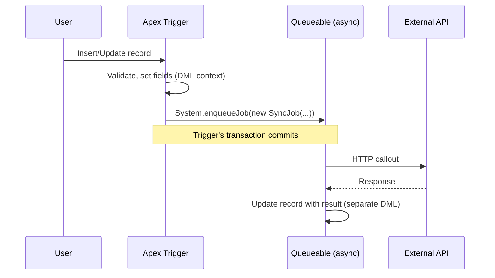

import Quiz from '@site/src/components/Quiz';
import LessonComplete from '@site/src/components/LessonComplete';
import TopicIconBadge from '@site/src/components/TopicIcon/Badge';

<TopicIconBadge id="outbound-callouts" />

# Outbound Callouts

An outbound callout is Salesforce reaching *out* to another system over HTTP — calling
a shipping API to get a rate quote, pushing a new Account to a billing system, or
checking inventory in a warehouse app. In Apex, this almost always means the `Http`,
`HttpRequest`, and `HttpResponse` classes.

## The basic shape

```apex
HttpRequest request = new HttpRequest();
request.setEndpoint('callout:Shipping_API/rates');
request.setMethod('POST');
request.setHeader('Content-Type', 'application/json');
request.setBody(JSON.serialize(new Map<String, Object>{
    'originZip' => '94105',
    'destinationZip' => '10001',
    'weightKg' => 2.5
}));
request.setTimeout(60000); // milliseconds; default is 10s, max is 120s

Http http = new Http();
HttpResponse response = http.send(request);

if (response.getStatusCode() == 200) {
    Map<String, Object> result = (Map<String, Object>) JSON.deserializeUntyped(response.getBody());
    // use result
} else {
    // handle non-2xx: log, throw, or retry depending on the error
}
```

Notice the endpoint: `callout:Shipping_API/rates`. The `callout:` prefix points at a
**Named Credential** called `Shipping_API` rather than a hardcoded URL — Salesforce
resolves the real endpoint and injects authentication for you. More on this in
[Authentication](./authentication.md).

## Callouts and transaction context

Apex callouts cannot run while there are pending, uncommitted DML changes in the same
transaction — and they are blocked entirely from a trigger's synchronous context. This
is why you'll often see a pattern like: a trigger fires → it enqueues a Queueable or
`@future(callout=true)` method → *that* asynchronous context makes the actual callout.



## Handling failures

External systems fail, time out, and rate-limit you. A callout wrapper should
distinguish between:

- **Transient errors** (timeouts, 503s, connection resets) — worth a bounded retry.
- **Client errors** (4xx) — usually a bug in the request; retrying won't help.
- **Governor-limit errors** — a sign the design needs to batch or throttle, not retry harder.

```apex
try {
    HttpResponse response = http.send(request);
    if (response.getStatusCode() >= 500) {
        // transient — candidate for retry via a re-enqueued Queueable
    } else if (response.getStatusCode() >= 400) {
        // client error — log and stop, don't blindly retry
    }
} catch (CalloutException e) {
    // network-level failure (timeout, DNS, etc.) — also a retry candidate
}
```

## Common mistakes

- **Calling out directly from a trigger.** This throws a runtime exception. Hand the
  call off to an asynchronous context instead.
- **Hardcoding endpoint URLs and API keys in Apex.** Use a Named Credential so secrets
  never live in code, debug logs, or version control.
- **Ignoring the 100-callouts / 120-seconds-per-transaction limits.** Large fan-out
  integrations need batching (Batch Apex, Queueable chaining) rather than one giant loop
  of callouts.
- **Retrying forever in a tight loop.** Always cap retry attempts, and prefer handing
  retries to an asynchronous job rather than looping synchronously.
- **Forgetting `setTimeout()`.** The 10-second default is often too short for slower
  third-party APIs, leading to intermittent, hard-to-reproduce failures.

## Learn more on Trailhead

[Apex Integration Services](https://trailhead.salesforce.com/content/learn/modules/apex_integration_services)
covers Apex REST and SOAP callouts in more depth, with hands-on practice.

## Quiz

<Quiz quizId="outbound-callouts" />

<LessonComplete topicId="outbound-callouts" />
