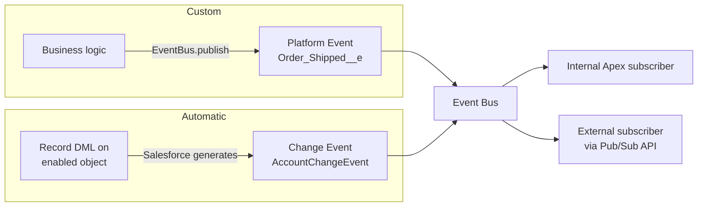

import Quiz from '@site/src/components/Quiz';
import LessonComplete from '@site/src/components/LessonComplete';
import TopicIconBadge from '@site/src/components/TopicIcon/Badge';
import LessonDownloads from '@site/src/components/LessonDownloads';

<TopicIconBadge id="platform-events-cdc" />

# Platform Events and Change Data Capture

Event-driven integration flips the usual question. Instead of "when should I call
out?" or "how often should I poll?", you ask: **what happened, and who needs to know?**
Salesforce has two main tools for this — **Platform Events** (events you define) and
**Change Data Capture / CDC** (automatic change events for standard and custom
objects).

## Platform Events: custom, business-defined events

A Platform Event is a custom-defined message with its own fields — you're not limited
to "a record changed," you can publish exactly the business event that matters, e.g.
`Order_Shipped__e` with fields like `OrderId__c` and `Carrier__c`.

```apex
Order_Shipped__e event = new Order_Shipped__e(
    OrderId__c = order.Id,
    Carrier__c = 'FedEx',
    TrackingNumber__c = '123456789'
);
EventBus.publish(event);
```

Subscribers — inside Salesforce (via a subscriber Apex trigger on the event) or
outside (via the Pub/Sub API over gRPC, or CometD/Streaming API for older tooling) —
receive the event close to real time, without polling.

## Change Data Capture: automatic record-change events

CDC watches standard or custom objects you enable and automatically publishes a change
event (create, update, delete, undelete) whenever a record changes — no custom event
definition or `EventBus.publish` call needed. Each change event carries the changed
field values and a header describing the change type.



## Platform Events vs. CDC — which one?

| Use **Platform Events** when... | Use **CDC** when... |
|---|---|
| The event is a business moment, not just "a field changed" (e.g. "order shipped", "SLA breached") | You want to replicate every change to a standard/custom object with no custom publish code |
| You want full control over the payload shape | The existing object schema is exactly what subscribers need |
| The event doesn't map cleanly to one record's lifecycle | You're building a sync/replication pipeline to an external data store |

## Common mistakes

- **Polling for events instead of subscribing.** If you're running a scheduled Apex
  job to "check for new events," you've reintroduced batch latency into what should be
  a real-time pattern — subscribe properly instead.
- **Publishing a Platform Event inside the same transaction as a DML operation that
  might roll back, without `EventBus.publish`'s delivery guarantees in mind.** Published
  events referencing in-progress, not-yet-committed data can confuse subscribers if the
  transaction later fails — understand "publish after commit" behavior for your event
  definition.
- **Enabling CDC on high-churn objects without a plan for event volume.** Every
  qualifying change produces an event; a noisy object can generate far more traffic
  than a subscriber expects.
- **Forgetting that event delivery isn't guaranteed to be instantaneous or ordered
  across unrelated records.** Design subscribers to be idempotent and tolerant of
  slight reordering rather than assuming strict, immediate sequencing.

## Learn more on Trailhead

- [Platform Events Basics](https://trailhead.salesforce.com/content/learn/modules/platform_events_basics)
- [Change Data Capture Basics](https://trailhead.salesforce.com/content/learn/modules/change-data-capture)

<LessonDownloads topicId="platform-events-cdc" />

## Quiz

<Quiz quizId="platform-events-cdc" />

<LessonComplete topicId="platform-events-cdc" />
