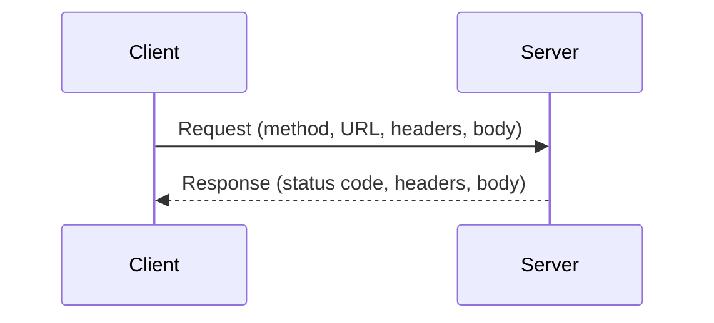

import Quiz from '@site/src/components/Quiz';
import LessonComplete from '@site/src/components/LessonComplete';
import TopicIconBadge from '@site/src/components/TopicIcon/Badge';
import LessonDownloads from '@site/src/components/LessonDownloads';

<TopicIconBadge id="protocols-explained" />

# HTTP, REST and SOAP: Protocols Explained

"Is REST a protocol?" "Does SOAP use JSON?" "Is OAuth a data format?" — these
questions come up constantly, and the confusion almost always comes from mixing up
three separate layers.

## Three layers people mix up

| Layer | What it is | Examples |
|---|---|---|
| **Transport** | How bytes actually travel between two machines | HTTP, HTTPS (HTTP + TLS encryption) |
| **Style / protocol** | The rules for structuring a request and response | REST, SOAP |
| **Data format** | How the payload itself is encoded | JSON, XML, CSV |

REST and SOAP both usually travel *over* HTTP(S) — they're not alternatives to HTTP,
they're built on top of it. And OAuth sits across all of these layers: it's neither a
transport, a style, nor a format — it's how the *caller proves who it is*, regardless
of which style or format you're using (more in
[Authentication Basics](./authentication-basics.md)).

## HTTP basics

HTTP requests use a small set of **methods**, each with a conventional meaning:

| Method | Meaning |
|---|---|
| `GET` | Read a resource, no side effects |
| `POST` | Create a new resource |
| `PUT` / `PATCH` | Update an existing resource (`PUT` typically replaces, `PATCH` partially updates) |
| `DELETE` | Delete a resource |

Every response carries a **status code**, grouped into families:

- **2xx — success.** The request worked.
- **3xx — redirect.** The resource has moved; follow the new location.
- **4xx — the caller's mistake.** Something about the request itself was wrong.
  - **401 Unauthorized** — no valid credentials were provided at all.
  - **403 Forbidden** — credentials were valid, but you're not allowed to do this.
  - **404 Not Found** — the resource doesn't exist (or you can't see that it does).
- **5xx — server problem.** The request was fine; the server failed to handle it.

## REST vs SOAP

**REST** is an architectural *style*, not a strict standard: every "thing" has a URL,
and you act on it using HTTP methods. It's stateless (each request carries everything
needed to understand it) and usually exchanges JSON.

**SOAP** is a stricter *protocol*: requests and responses are XML "envelopes" with a
defined structure, the service's contract is described by a **WSDL** (Web Services
Description Language) document, and it has built-in standards like **WS-Security**
for things REST usually leaves to you.

### The same request, two ways

A REST `GET` to a simple public test API, `/todos/1`:

```
GET https://jsonplaceholder.typicode.com/todos/1
```

Response:

```json
{
  "userId": 1,
  "id": 1,
  "title": "delectus aut autem",
  "completed": false
}
```

The same idea as a (simplified — real SOAP envelopes carry more XML scaffolding)
SOAP request:

```xml
<soap:Envelope xmlns:soap="http://schemas.xmlsoap.org/soap/envelope/">
  <soap:Body>
    <GetTodoRequest>
      <TodoId>1</TodoId>
    </GetTodoRequest>
  </soap:Body>
</soap:Envelope>
```

## Comparison at a glance

| | REST | SOAP |
|---|---|---|
| **Format** | Usually JSON | XML only |
| **Contract** | Informal (often OpenAPI/Swagger) | Formal, machine-readable WSDL |
| **Weight** | Lighter payloads | Heavier, more scaffolding per message |
| **Tooling** | Broad, simple HTTP tooling (Postman, curl, any HTTP client) | Needs SOAP-aware tooling to generate/consume the WSDL |
| **Typical users** | Modern web/mobile APIs | Enterprise systems, legacy middleware, partners with existing SOAP contracts |
| **In Salesforce** | REST API, Apex REST, Apex callouts | SOAP API, Apex SOAP services, WSDL2Apex-generated classes |

## A request and a response



## Rule of thumb

**Default to REST for new work.** Reach for SOAP only when the other system *only*
offers a SOAP endpoint, or a partner explicitly requires a WSDL contract.

## Common mistakes

- **Assuming a 404 throws a catchable error automatically.** In Apex, an `Http` call
  that gets a 404 doesn't throw an exception by itself — `HttpResponse.getStatusCode()`
  just returns `404`, and it's *your* code's job to check it. See
  [Anatomy of a Request and Response](./request-response-anatomy.md).
- **Mixing up REST and JSON.** REST is a style for structuring requests; JSON is just
  the format most REST APIs happen to use. You can technically build a REST API that
  returns XML.
- **Treating OAuth as a data protocol.** OAuth governs *authentication*, not the shape
  of your payload — it's orthogonal to whether you're using REST or SOAP, JSON or XML.

## Learn more on Trailhead

[Apex Integration Services](https://trailhead.salesforce.com/content/learn/modules/apex_integration_services)
covers calling and exposing REST and SOAP services from Apex.

For free, hands-on practice with real REST requests and responses, try
[JSONPlaceholder](https://jsonplaceholder.typicode.com/) — a free fake API used
throughout this course's examples.

<LessonDownloads topicId="protocols-explained" />

## Quiz

<Quiz quizId="protocols-explained" />

<LessonComplete topicId="protocols-explained" />
