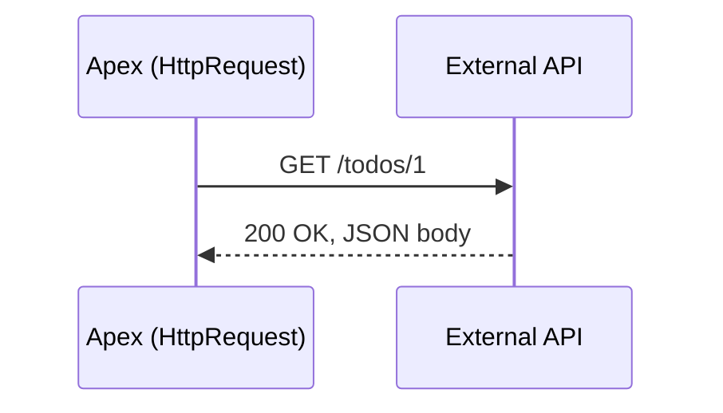

import Quiz from '@site/src/components/Quiz';
import LessonComplete from '@site/src/components/LessonComplete';
import TopicIconBadge from '@site/src/components/TopicIcon/Badge';
import LessonDownloads from '@site/src/components/LessonDownloads';

<TopicIconBadge id="request-response-anatomy" />

# Anatomy of a Request and Response

Every HTTP call, no matter the tool — Postman, `curl`, or Apex's `Http` class — is
built from the same handful of parts. Once you can name them, reading any API's
documentation gets a lot easier.

## Parts of a request

| Part | What it is | Example |
|---|---|---|
| **Method** | The action being taken | `GET` |
| **URL** | Where the request is going | `https://jsonplaceholder.typicode.com/todos/1` |
| **Headers** | Metadata about the request | `Content-Type: application/json` |
| **Body** | The data being sent (not used for `GET`) | `{"title": "Buy milk"}` |

## Parts of a response

| Part | What it is | Example |
|---|---|---|
| **Status code** | Did it work, and in what way | `200` |
| **Headers** | Metadata about the response | `Content-Type: application/json` |
| **Body** | The data being returned | `{"id": 1, "title": "delectus aut autem", ...}` |

## Headers that matter most

- **`Content-Type`** — tells the *receiver* what format the body is in (e.g.
  `application/json`). Set this on requests that have a body.
- **`Accept`** — tells the *server* what format you'd like the response in. Not every
  API honors it, but well-behaved ones do.
- **`Authorization`** — carries the credentials proving who's calling (e.g.
  `Bearer <token>`). See [Authentication Basics](./authentication-basics.md).

## Path parameters vs query parameters

- **Path parameter:** part of the URL's structure itself, usually identifying *which*
  resource. `/todos/1` — `1` is the path parameter identifying todo #1.
- **Query parameter:** appended after a `?`, usually used to filter, sort, or page a
  result set. `/todos?userId=1` — `userId=1` filters the list to one user's todos.

## A worked example

Using the free [JSONPlaceholder](https://jsonplaceholder.typicode.com/) test API —
real, public, and safe to experiment against.

**1. Get one specific todo (path parameter):**

```
GET https://jsonplaceholder.typicode.com/todos/1
```

```json
{
  "userId": 1,
  "id": 1,
  "title": "delectus aut autem",
  "completed": false
}
```

**2. Get a filtered list (query parameter):**

```
GET https://jsonplaceholder.typicode.com/todos?userId=1
```

This returns a JSON *array* of every todo belonging to user 1, instead of a single
object.

**3. Create a todo:**

```
POST https://jsonplaceholder.typicode.com/todos
Content-Type: application/json

{
  "userId": 1,
  "title": "Learn API basics",
  "completed": false
}
```

JSONPlaceholder responds as if it created the record (status `201`, body echoed back
with a new `id`), but it's a test API — **nothing is actually saved**. It's there so
you can safely practice every HTTP method without needing a real backend.

## Mapping the pieces to Postman and Apex

| Request/response part | Postman field | Apex |
|---|---|---|
| Method | Method dropdown (GET, POST, ...) | `request.setMethod('GET')` |
| URL | URL bar | `request.setEndpoint(url)` |
| Headers | Headers tab | `request.setHeader(name, value)` |
| Body | Body tab | `request.setBody(jsonString)` |
| Status code | Response status (e.g. "200 OK") | `response.getStatusCode()` |
| Response body | Response panel | `response.getBody()` |

## One request, one response



## Common mistakes

- **Forgetting `Content-Type` on a request with a body.** Many APIs will reject or
  misinterpret the body if they don't know it's JSON.
- **Confusing a path parameter with a query parameter when reading docs.** If an API
  doc shows `/users/{id}/orders`, `{id}` is a path parameter — it's part of the URL
  structure, not something you append with `?`.
- **Not checking the status code before trusting the body.** A response can still
  have a body on a 4xx or 5xx error (often an error message) — always check the
  status first.

<LessonDownloads topicId="request-response-anatomy" />

## Quiz

<Quiz quizId="request-response-anatomy" />

<LessonComplete topicId="request-response-anatomy" />
