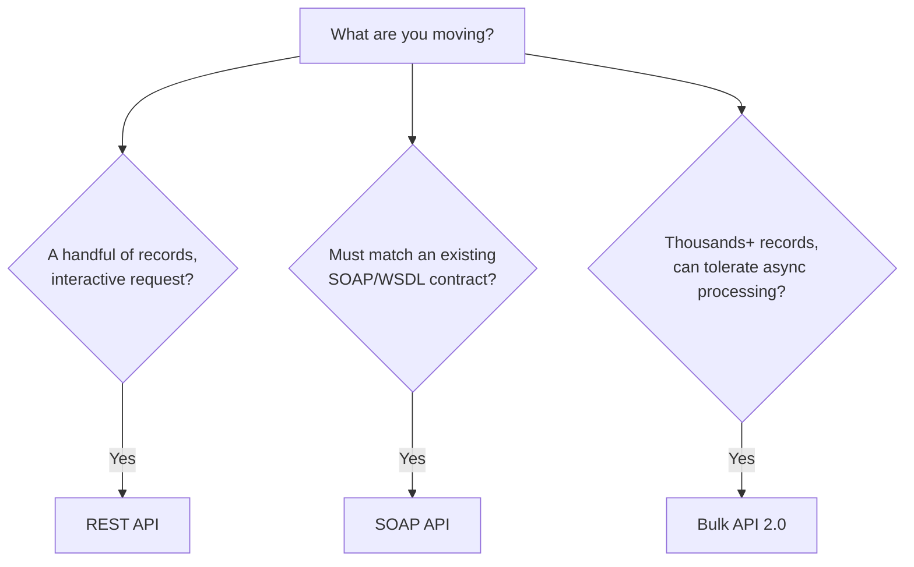

import Quiz from '@site/src/components/Quiz';
import LessonComplete from '@site/src/components/LessonComplete';
import TopicIconBadge from '@site/src/components/TopicIcon/Badge';

<TopicIconBadge id="salesforce-apis" />

# Salesforce APIs

"The Salesforce API" isn't one thing — it's a family of APIs, each built for a
different job. Picking the wrong one is a common source of slow, fragile
integrations.

## The main APIs at a glance

| API | Best for | Notes |
|---|---|---|
| **REST API** | General-purpose CRUD on records, simple and widely supported | JSON over HTTP; the default choice for most new integrations |
| **SOAP API** | Legacy systems or strict enterprise standards requiring WSDL/XML | Heavier payloads; still common in older enterprise middleware |
| **Bulk API 2.0** | Loading or exporting large volumes of records (thousands to millions) | Asynchronous, chunked, designed to avoid timeouts and limit exhaustion |
| **Streaming API / Pub-Sub API** | Subscribing to a continuous stream of events or changes | Underpins Platform Events and Change Data Capture (CDC) |
| **Metadata API / Tooling API** | Deploying or inspecting org configuration (fields, objects, Apex) | Used by CI/CD tools and IDEs, not typically by day-to-day business integrations |

## Choosing between REST, SOAP, and Bulk



In practice: **default to REST API** unless something specific pulls you elsewhere —
either a legacy SOAP requirement on the other side, or a data volume that REST wasn't
designed for.

## A quick REST API example

Reading an Account by Id with the REST API:

```
GET /services/data/v61.0/sobjects/Account/001XXXXXXXXXXXXXXX
Authorization: Bearer <access_token>
```

Creating one:

```
POST /services/data/v61.0/sobjects/Account
Authorization: Bearer <access_token>
Content-Type: application/json

{
  "Name": "Acme Robotics",
  "Industry": "Manufacturing"
}
```

Every call needs a valid access token — see [Authentication](./authentication.md) for
how to get one safely.

## Why Bulk API exists

The REST API processes one record (or a small composite batch) per request, which is
fine for interactive use but inefficient — and limit-expensive — for loading 500,000
rows. Bulk API 2.0 instead:

1. Accepts a CSV (or JSON) upload describing the job.
2. Processes it asynchronously in chunks on Salesforce's servers.
3. Lets you poll for job status and download success/failure results separately.

This trades immediacy for throughput and resilience against timeouts.

## Common mistakes

- **Using REST API in a tight loop for bulk loads.** Thousands of sequential REST calls
  will hit API request limits and run slowly; Bulk API 2.0 exists for exactly this case.
- **Choosing SOAP "because it feels more enterprise."** Unless you have an explicit
  requirement to match a SOAP contract, REST is simpler, lighter, and better supported
  by modern tooling.
- **Not versioning API calls deliberately.** Pin a specific API version
  (e.g. `v61.0`) in production integrations so a future Salesforce release doesn't
  silently change behavior under you.
- **Confusing Streaming/Pub-Sub API with polling.** These APIs push events to
  subscribers; if your integration is still polling on a timer, you're not using them
  as intended — see [Platform Events and CDC](./platform-events-cdc.md).

## Learn more on Trailhead

[Platform API Basics](https://trailhead.salesforce.com/content/learn/modules/api_basics)
covers REST, SOAP, Bulk 2.0, and the Pub/Sub API with guided practice.

## Quiz

<Quiz quizId="salesforce-apis" />

<LessonComplete topicId="salesforce-apis" />
