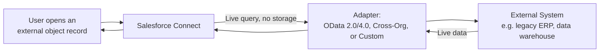

import Quiz from '@site/src/components/Quiz';
import LessonComplete from '@site/src/components/LessonComplete';
import TopicIconBadge from '@site/src/components/TopicIcon/Badge';
import LessonDownloads from '@site/src/components/LessonDownloads';

<TopicIconBadge id="salesforce-connect" />

# Salesforce Connect

Every pattern so far either moves data into Salesforce or pushes data out of it.
**Salesforce Connect** takes a third approach: it lets users and automation work with
external data *as if* it were a Salesforce record — without ever storing a copy.

## How it works

Salesforce Connect maps rows in an external system to **external objects** (the
`__x` suffix, parallel to `__c` for custom objects). When a user opens an external
object record, Salesforce queries the external system live, in real time, and renders
the result as if it were a normal record — list views, related lists, and (with the
right adapter) even reports can work against it.

## The three adapter types

- **OData adapters (2.0 / 4.0):** connect to any system that exposes an OData
  endpoint — many enterprise data platforms and legacy systems already do.
- **Cross-Org Adapter:** connects one Salesforce org's data live into another
  Salesforce org, without replication.
- **Custom Adapter:** built with Apex (`DataSource.Connection`) when the source system
  doesn't speak OData and isn't another Salesforce org — you implement the query/search
  logic yourself.

## Why not just sync the data in?

| Salesforce Connect (external objects) | Traditional sync (ETL, batch jobs, middleware) |
|---|---|
| Data is always current — no staleness window | Data is only as fresh as the last sync |
| No storage cost or data-storage limits consumed in Salesforce | Consumes Salesforce data storage |
| Read performance depends on the external system's responsiveness | Read performance is local to Salesforce |
| Best for reference/lookup data that changes externally and is read, not transformed, by Salesforce | Better when Salesforce needs to run heavy reporting/automation against the data, or the external system can't handle live query load |

A common real-world pattern: use Salesforce Connect for a legacy ERP's product catalog
(always current, read-mostly), while still syncing transactional data like orders into
native Salesforce objects where automation and reporting need it.

## Common mistakes

- **Pointing Salesforce Connect at a slow or rate-limited external system and exposing
  it on a heavily-trafficked list view.** Every view is a live call — a slow backend
  becomes a slow Salesforce page for every user.
- **Expecting full feature parity with native objects.** External objects have real
  limitations around validation rules, triggers, and some reporting features —
  check the adapter's documented limits before committing to the approach.
- **Using Salesforce Connect where a nightly batch sync would genuinely be simpler
  and sufficient.** Live access is powerful but adds a live runtime dependency on the
  external system being up and fast; don't pay that cost if slightly-stale data is
  perfectly fine for the use case.
- **Building a Custom Adapter without first checking for an existing OData endpoint.**
  A custom `DataSource.Connection` implementation is real engineering work — confirm
  the source system can't already speak OData before committing to it.

## Learn more on Trailhead

[Quick Start: Salesforce Connect](https://trailhead.salesforce.com/content/learn/projects/quickstart-lightning-connect)
is a hands-on project that walks through setting up external objects.

<LessonDownloads topicId="salesforce-connect" />

## Quiz

<Quiz quizId="salesforce-connect" />

<LessonComplete topicId="salesforce-connect" />
