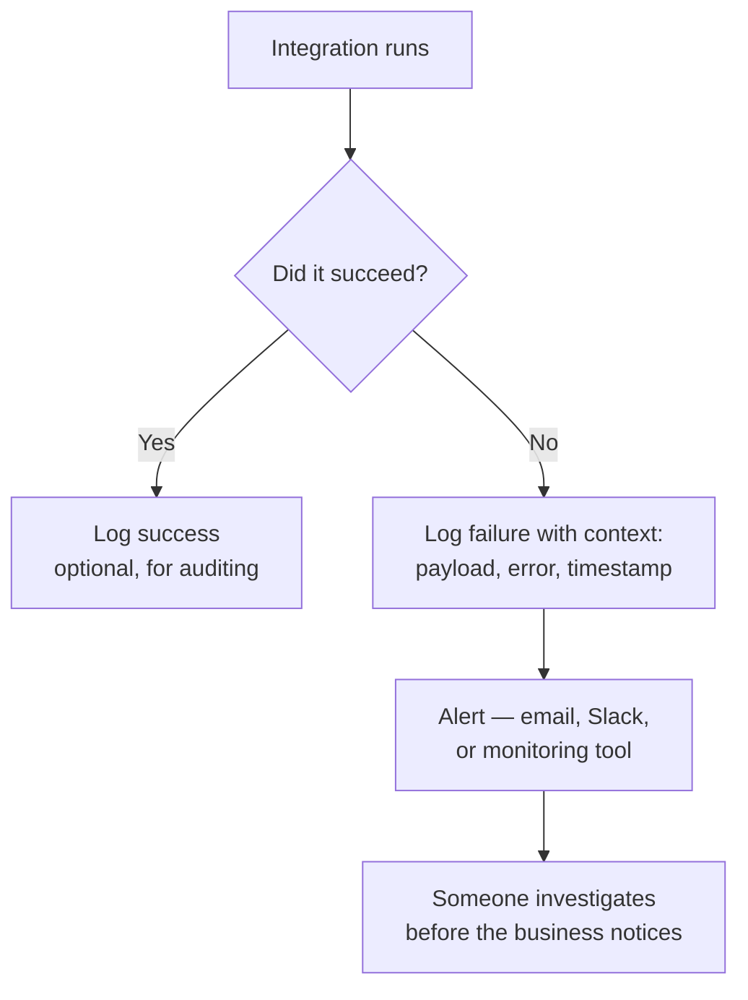

import Quiz from '@site/src/components/Quiz';
import LessonComplete from '@site/src/components/LessonComplete';
import TopicIconBadge from '@site/src/components/TopicIcon/Badge';
import LessonDownloads from '@site/src/components/LessonDownloads';

<TopicIconBadge id="security-monitoring" />

# Security and Monitoring

A working integration that nobody is watching is a future incident. This lesson pulls
together security practices from earlier lessons and adds the operational half:
knowing when something breaks.

## Securing outbound integrations

- **Never hardcode secrets.** Use Named Credentials / External Credentials
  (see [Authentication](./authentication.md)) so API keys and tokens live in
  Salesforce's secure credential store, not in Apex, Flow variables, or Custom Labels.
- **Scope the integration user tightly.** A dedicated integration user with a minimal
  permission set — only the object/field access it actually needs — limits the blast
  radius if a token is ever compromised.
- **Prefer OAuth flows designed for server-to-server use** (JWT Bearer, Client
  Credentials) over a named human user's password for anything automated.

## Securing inbound integrations

- **Validate every input.** Don't trust payload shape or field types from any external
  caller, even an "internal" one — see
  [Inbound Apex REST and SOAP](./inbound-apex-rest-soap.md) for a worked example.
- **Respect the existing security model.** `with sharing` and explicit CRUD/FLS checks
  (or `Security.stripInaccessible`) ensure the authenticated user's real permissions
  still apply, even inside a custom Apex REST endpoint.
- **Use IP allowlisting and login IP ranges where appropriate**, especially for
  integration users that should only ever connect from known server infrastructure.
- **Rotate credentials on a schedule**, and immediately whenever a team member with
  credential access leaves or a vendor relationship ends.

## Monitoring: how do you know it's broken?

Practical tools for this, roughly in order of how much setup they need:

- **Apex try/catch + a custom log object or Platform Event.** The baseline: capture
  failures with enough context (endpoint, status code, payload summary) to debug
  without reproducing the issue live.
- **Debug Logs.** Useful for development, but not a monitoring strategy — they expire
  and aren't searchable at scale.
- **Apex Exception Email Alerts.** A quick way to get notified of unhandled Apex
  exceptions without building custom logging.
- **Event Monitoring / Real-Time Event Monitoring (where licensed).** Gives
  org-level visibility into API usage, login patterns, and more — useful for spotting
  abuse or unusual integration behavior, not just outright failures.

## Common mistakes

- **Treating "it worked in testing" as "it's monitored in production."** Integrations
  degrade quietly — a renamed field, an expired certificate, a changed rate limit —
  long before anyone notices without active monitoring.
- **Logging failures without enough context to act on them.** A log entry that just
  says "callout failed" is nearly useless; capture the endpoint, status code, and a
  safe summary of the payload (never log secrets or full sensitive payloads).
- **Alerting on everything, so nobody reads the alerts.** Tune alerts to things that
  need action; noisy monitoring trains people to ignore it.
- **Leaving a stale integration user active after a project ends.** Deactivate or
  tightly re-scope credentials and permission sets once an integration is
  decommissioned — unused access is unmonitored risk.

## Learn more on Trailhead

[Real-Time Event Monitoring](https://trailhead.salesforce.com/content/learn/modules/realtime-event-monitoring)
covers org-level visibility into events, logins, and API usage (features vary by
edition and add-on licensing).

<LessonDownloads topicId="security-monitoring" />

## Quiz

<Quiz quizId="security-monitoring" />

<LessonComplete topicId="security-monitoring" />
