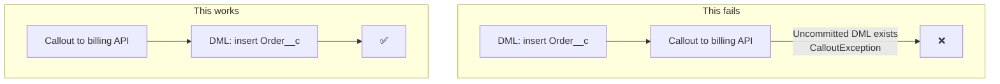

import Quiz from '@site/src/components/Quiz';
import LessonComplete from '@site/src/components/LessonComplete';
import TopicIconBadge from '@site/src/components/TopicIcon/Badge';
import LessonDownloads from '@site/src/components/LessonDownloads';

<TopicIconBadge id="why-salesforce-is-different" />

# Why Salesforce Is Different for Integrators

A developer coming from a traditional backend — their own server, their own database,
no neighbors — hits a few surprises the first time they write an integration against
Salesforce. Most of them trace back to one root cause: **Salesforce is
multi-tenant.**

## Multi-tenancy and governor limits

Your org doesn't run on a dedicated server just for you — it shares infrastructure
with every other Salesforce customer. To stop one org's runaway code (an infinite
loop, an unbounded query, a callout storm) from degrading performance for everyone
else sharing that infrastructure, Salesforce enforces strict **governor limits** on
things like the number of queries, DML statements, and callouts a single transaction
can make. These aren't suggestions or soft warnings — exceed one, and Apex throws an
unhandleable `LimitException` that stops the transaction.

## API versions in the URL

Every Salesforce API call is pinned to a version, right in the endpoint:

```
/services/data/v61.0/sobjects/Account/001XXXXXXXXXXXXXXX
```

**Pinning a version deliberately protects your integration.** Salesforce ships new
releases multiple times a year, and while most changes are additive, pinning to a
specific version means your integration keeps behaving the way it did when you built
it — it won't silently start seeing new fields or behavior changes until *you*
choose to move to a newer version.

## Org API request limits

Your org has a daily limit on the total number of API requests it can make, shared
across every integration hitting it. Rather than quoting a number here (it varies by
org edition and license, and changes over time), **check it yourself**: Setup →
System Overview shows your org's current API usage against its limit in real time —
make that part of your routine when debugging a sudden integration slowdown.

## Apex callout rules

Three concrete rules shape how Apex callouts behave in a single transaction:

- **Up to 100 callouts per transaction.**
- **A default timeout of 10 seconds per callout, which can be raised up to 120
  seconds.**
- **No callout is allowed after the transaction has made uncommitted database
  changes.** Once you've done a DML operation (insert/update/delete) that hasn't been
  committed, Salesforce blocks any further callout in that same transaction.

That last rule trips up almost everyone the first time:



The fix is almost always to **reorder the work**: do the callout first, then the DML
— or, more commonly, move the callout into an asynchronous context entirely.

## Why callouts from triggers must be asynchronous

A trigger runs inside a larger transaction that Salesforce manages for you — and that
transaction is very likely to include DML (the very save you're reacting to). Since a
callout can't happen after uncommitted DML in the same transaction, a trigger can
never make a callout directly. Instead, it has to hand the work off to an
asynchronous context (like `@future(callout=true)` or Queueable Apex) that runs in
its *own*, separate transaction. The mechanics of exactly how — and which async tool
to reach for — are covered in a later lesson.

## What a general developer expects vs what Salesforce does

| A general backend developer expects... | Salesforce actually does... |
|---|---|
| "My server, my rules — resources are mine alone" | Shared infrastructure, strictly governed per-transaction limits |
| "I can call out any time, including right after I save something" | No callout allowed after uncommitted DML in the same transaction |
| "The API I call today behaves the same next year unless I upgrade" | True, *if* you pin an API version — unpinned calls can see changes over time |
| "A trigger can do whatever the handler code does, synchronously" | A trigger can't make a direct callout — it must go async |

## Common mistakes

- **Making a callout immediately after a DML statement in the same method.** This
  throws a `CalloutException` — reorder so DML happens after the callout, or move the
  callout to its own transaction.
- **Not pinning an API version in production integrations.** Letting a client default
  to "whatever version is current" risks an unexpected behavior change on a future
  release.
- **Trying to call out directly from a trigger.** It will fail — triggers must hand
  callout work to an asynchronous context.
- **Ignoring governor limit exceptions until they happen in production.** Limits are
  enforced the same way in every environment — test against realistic data volumes,
  not just a handful of sample records.

## Learn more on Trailhead

[Explore Salesforce Architecture and Its Key Components](https://trailhead.salesforce.com/content/learn/modules/starting_force_com/starting_understanding_arch)
explains multi-tenancy using an apartment-building analogy.

<LessonDownloads topicId="why-salesforce-is-different" />

## Quiz

<Quiz quizId="why-salesforce-is-different" />

<LessonComplete topicId="why-salesforce-is-different" />
